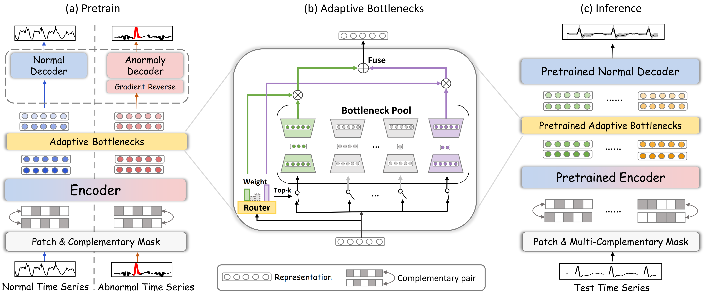

# Towards A General Time Series Anomaly Detector with Adaptive Bottlenecks And Dual Adversarial Decoders

This code is the official PyTorch implementation of our ICLR'25 paper: Towards a General Time Series Anomaly Detector with Adaptive Bottlenecks and Dual Adversarial Decoders. In this paper, we produce a general time series anomaly detector [DADA](https://arxiv.org/abs/2405.15273). By pre-training on multi-domain time series
data, we achieve the goal of “one-model-for-many”, meaning a single model can perform
anomaly detection on various target scenarios efficiently without domain-specific training.

If you find this project helpful, please don't forget to give it a ⭐ Star to show your support. Thank you!

🚩 News (2025.01) DADA has been accepted by ICLR 2025.



## Requirements
We run our project under Python 3.8. You can install the dependencies with the following command:

```shell
pip install -r requirements.txt
```

## Data Preparation
Datasets can be downloaded at this link: https://drive.google.com/file/d/1QumS8bSRsLZT7u5TWLaWctDWvGnSyeRB/view?usp=drive_link.

## Evaluation
As a general time series anomaly detector, DADA can perform anomaly detection on various target scenarios with out domain-specific training. You can directly test on target datasets as the following scripts:

```shell
sh ./scripts/DADA.sh
```

## Citation

If you find this repo useful, please cite our paper:
```
@inproceedings{shentu2025towards,
 title     = {Towards a General Time Series Anomaly Detector with Adaptive Bottlenecks and Dual Adversarial Decoders},
 author    = {Shentu, Qichao and Li, Beibu and Zhao, Kai and Shu, Yang and Rao, Zhongwen and Pan, Lujia and Yang, Bin and Guo, Chenjuan},
 booktitle = {ICLR},
 year      = {2025}
}# DADA
